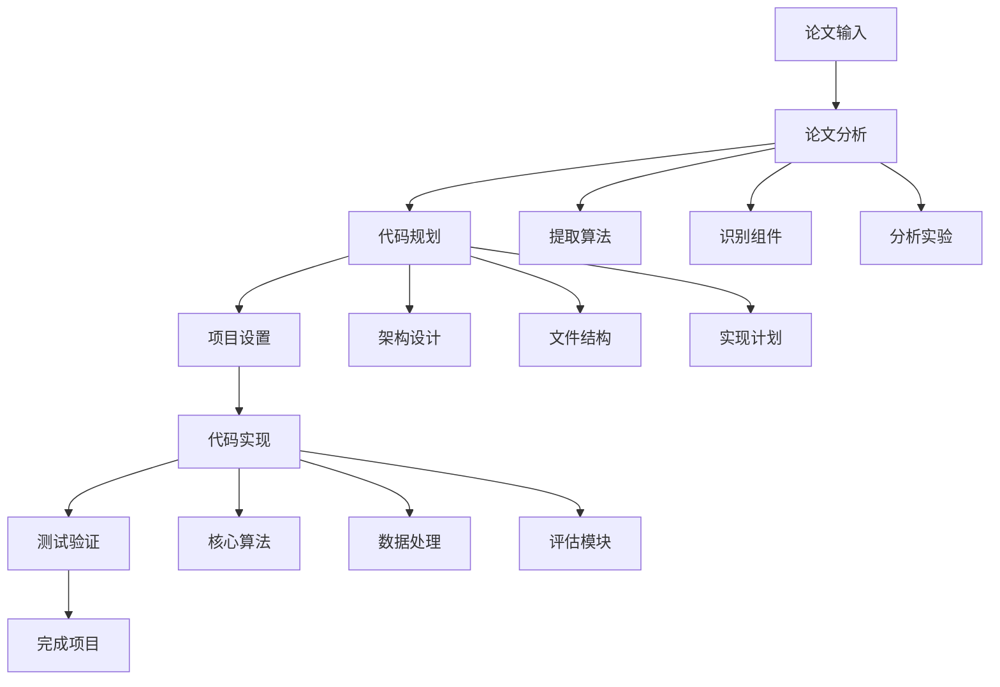

# 论文到代码工作流指南

这个指南详细说明如何使用Cursor编辑器和我们的prompt集合，将学术论文转换为可执行的代码实现。

## 工作流概览



## 详细步骤

### 步骤1：论文分析 📊

**目标**：深入理解论文内容，提取所有实现相关的技术细节

**使用prompt**：`core_prompts/paper_analysis.md`

**操作步骤**：
1. 在Cursor中打开 `paper_analysis.md`
2. 复制完整的prompt内容
3. 在新的对话中粘贴prompt
4. 提供论文内容（以下任一方式）：
   - 直接粘贴论文文本
   - 提供论文PDF的文本提取
   - 提供论文的URL链接
   - 上传论文文件

**输入示例**：
```
[粘贴论文分析prompt]

请分析以下论文：

标题：Graph Convolutional Networks for Semi-Supervised Classification
作者：Thomas N. Kipf, Max Welling

摘要：
We present a scalable approach for semi-supervised learning on graph-structured data that is based on an efficient variant of convolutional neural networks which operate directly on graphs...

[论文完整内容]
```

**预期输出**：
- 结构化的YAML格式分析结果
- 包含算法、数学公式、架构设计等所有技术细节
- 实现优先级和复杂度评估

### 步骤2：代码规划 🏗️

**目标**：将论文分析结果转换为详细的实现计划

**使用prompt**：`core_prompts/code_planning.md`

**操作步骤**：
1. 在Cursor中打开 `code_planning.md`
2. 复制完整的prompt内容
3. 在对话中继续或开始新对话
4. 将步骤1的分析结果作为输入提供

**输入示例**：
```
[粘贴代码规划prompt]

请根据以下论文分析结果生成详细的实现计划：

[粘贴步骤1的YAML分析结果]

项目要求：
- 使用Python和PyTorch
- 支持多种图数据集
- 包含训练和评估脚本
- 提供可视化功能
```

**预期输出**：
- 完整的项目架构设计
- 详细的文件结构规划
- 分阶段的实现计划
- 技术栈和依赖选择

### 步骤3：项目设置 ⚙️

**目标**：创建项目结构和配置文件

**使用prompt**：`core_prompts/project_setup.md`

**操作步骤**：
1. 在Cursor中打开 `project_setup.md`
2. 复制完整的prompt内容
3. 提供项目基本信息

**输入示例**：
```
[粘贴项目设置prompt]

项目信息：
- 项目名称: graph-convolutional-networks
- 项目类型: research
- 技术栈: Python, PyTorch, NetworkX
- 特殊需求: GPU支持, 图可视化, 多数据集支持
```

**操作建议**：
1. 按照输出的目录结构在本地创建文件夹
2. 复制所有配置文件内容到相应位置
3. 运行设置脚本初始化环境

### 步骤4：代码实现 💻

**目标**：逐步实现所有代码模块

**使用prompt**：`core_prompts/code_implementation.md`

**操作步骤**：
1. 在Cursor中打开 `code_implementation.md`
2. 复制完整的prompt内容
3. 按照实现计划逐个实现模块

**实现策略**：

#### 策略A：完整实现
```
[粘贴代码实现prompt]

请根据以下实现计划生成完整的项目代码：

[粘贴步骤2的实现计划]

请按照以下顺序实现：
1. 核心GCN算法模块 (src/models/gcn.py)
2. 数据加载和预处理 (src/data/loader.py)
3. 训练脚本 (scripts/train.py)
4. 评估脚本 (scripts/evaluate.py)
5. 配置文件 (configs/default.yaml)
```

#### 策略B：增量实现
```
[粘贴代码实现prompt]

请首先实现核心GCN模型：

文件：src/models/gcn.py
功能：
- 实现图卷积层
- 实现完整的GCN网络
- 支持半监督学习
- 包含前向传播和参数初始化

要求：
- 使用PyTorch实现
- 包含详细的文档字符串
- 实现适当的错误处理
- 支持GPU加速
```

### 步骤5：测试验证 🧪

**目标**：验证实现的正确性和性能

**操作步骤**：
1. 运行单元测试
2. 进行集成测试
3. 性能基准测试
4. 与论文结果对比

**测试清单**：
- [ ] 所有模块可以正常导入
- [ ] 核心算法逻辑正确
- [ ] 数据加载和预处理正常
- [ ] 训练过程收敛
- [ ] 评估指标符合预期
- [ ] 代码通过静态检查

### 步骤6：优化完善 🚀

**目标**：优化性能，完善功能

**可能的优化方向**：
- 性能优化（GPU加速、内存优化）
- 功能扩展（更多数据集支持、可视化）
- 代码质量（重构、文档完善）
- 用户体验（CLI接口、配置简化）

## 最佳实践

### 1. 分阶段实现
- 不要试图一次实现所有功能
- 先实现核心算法，再添加辅助功能
- 每个阶段都要进行测试验证

### 2. 保持与论文的一致性
- 严格按照论文中的算法描述实现
- 使用论文中的符号和命名约定
- 实现论文中的所有实验设置

### 3. 代码质量保证
- 编写清晰的文档字符串
- 添加适当的类型提示
- 实现全面的错误处理
- 遵循代码规范

### 4. 版本控制
- 使用Git跟踪代码变更
- 为每个重要功能创建分支
- 编写清晰的提交信息

### 5. 文档维护
- 及时更新README文件
- 记录重要的设计决策
- 提供使用示例和教程

## 常见问题解决

### Q1: 论文中的算法描述不够详细怎么办？
**A1**: 
- 查找论文的补充材料
- 搜索相关的开源实现作为参考
- 根据常见做法填补缺失的细节
- 在代码中明确标注假设和默认值

### Q2: 实现结果与论文报告的性能不符怎么办？
**A2**:
- 检查算法实现是否正确
- 验证超参数设置
- 确认数据预处理步骤
- 检查评估指标的计算方法

### Q3: 代码运行时出现内存或性能问题怎么办？
**A3**:
- 使用批处理减少内存占用
- 实现GPU加速
- 优化数据加载流程
- 考虑使用更高效的数据结构

### Q4: 如何处理论文中没有提到的实现细节？
**A4**:
- 参考相关领域的标准做法
- 查看同类算法的实现方式
- 进行消融实验验证不同选择的影响
- 在文档中说明自己的设计选择

## 示例项目

### 完整示例：GCN实现

**论文**：Graph Convolutional Networks for Semi-Supervised Classification

**实现结果**：
```
gcn-implementation/
├── src/
│   ├── models/
│   │   ├── gcn.py              # GCN模型实现
│   │   └── layers.py           # 图卷积层
│   ├── data/
│   │   ├── loader.py           # 数据加载
│   │   └── datasets.py         # 数据集定义
│   └── utils/
│       ├── metrics.py          # 评估指标
│       └── visualization.py    # 可视化工具
├── scripts/
│   ├── train.py               # 训练脚本
│   ├── evaluate.py            # 评估脚本
│   └── demo.py                # 演示脚本
├── configs/
│   └── cora.yaml              # Cora数据集配置
├── tests/
│   ├── test_models.py         # 模型测试
│   └── test_data.py           # 数据测试
└── README.md                  # 项目说明
```

**关键实现文件**：

1. **GCN模型** (`src/models/gcn.py`)
2. **图卷积层** (`src/models/layers.py`)
3. **训练脚本** (`scripts/train.py`)
4. **数据加载器** (`src/data/loader.py`)

## 进阶技巧

### 1. 使用Cursor的AI功能
- 利用Cursor的代码补全功能加速开发
- 使用AI助手解释复杂的数学公式
- 让AI帮助优化代码结构和性能

### 2. 集成开发工具
- 配置代码格式化工具（Black, isort）
- 使用静态分析工具（flake8, mypy）
- 集成测试框架（pytest）

### 3. 实验管理
- 使用配置文件管理实验参数
- 实现实验日志记录
- 使用版本控制跟踪实验结果

### 4. 性能监控
- 添加性能分析代码
- 监控内存使用情况
- 记录训练和推理时间

通过遵循这个工作流，您可以系统性地将任何学术论文转换为高质量的代码实现。记住，实现过程是迭代的，不要害怕回到之前的步骤进行调整和改进。