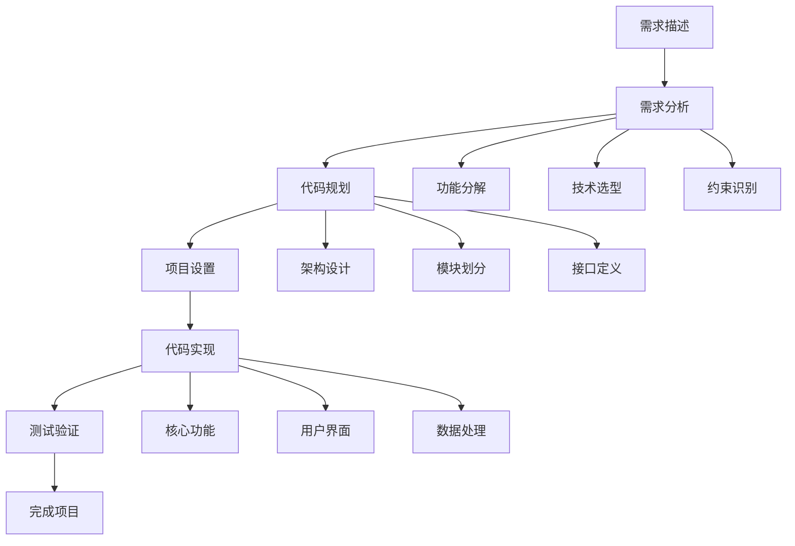

# 需求到代码工作流指南

这个指南说明如何使用Cursor编辑器和我们的prompt集合，直接从文本需求描述生成完整的代码实现。

## 工作流概览



## 适用场景

这个工作流适用于以下类型的项目：

### 1. Web应用开发
- API服务
- 前端应用
- 全栈项目
- 微服务架构

### 2. 数据处理工具
- 数据分析脚本
- ETL管道
- 数据可视化
- 报告生成器

### 3. 命令行工具
- 系统工具
- 开发工具
- 自动化脚本
- 批处理程序

### 4. 机器学习项目
- 模型训练
- 数据预处理
- 预测服务
- 实验管理

### 5. 库和框架
- 工具库
- SDK开发
- 插件系统
- 框架扩展

## 详细步骤

### 步骤1：需求整理和分析 📋

**目标**：将模糊的需求描述转换为清晰的技术规格

**准备工作**：
1. 收集所有相关需求
2. 识别核心功能和次要功能
3. 明确技术约束和限制
4. 确定成功标准

**需求模板**：
```markdown
## 项目概述
- **项目名称**：[项目名称]
- **项目类型**：[web_app/cli_tool/library/data_tool/ml_project]
- **目标用户**：[目标用户群体]
- **核心价值**：[项目解决的主要问题]

## 功能需求
### 核心功能（必须实现）
1. 功能1：[详细描述]
2. 功能2：[详细描述]
3. 功能3：[详细描述]

### 扩展功能（可选实现）
1. 功能A：[详细描述]
2. 功能B：[详细描述]

## 技术需求
- **编程语言**：[Python/JavaScript/Go等]
- **框架偏好**：[Flask/FastAPI/React等]
- **数据库**：[MySQL/PostgreSQL/MongoDB等]
- **部署环境**：[本地/云服务/容器等]
- **性能要求**：[响应时间/并发量等]

## 约束条件
- **时间限制**：[开发周期]
- **资源限制**：[人力/硬件/预算]
- **技术限制**：[必须使用/不能使用的技术]
- **兼容性要求**：[浏览器/操作系统/版本]

## 验收标准
- [ ] 标准1：[具体的验收条件]
- [ ] 标准2：[具体的验收条件]
- [ ] 标准3：[具体的验收条件]
```

### 步骤2：代码规划 🏗️

**目标**：将需求转换为详细的技术实现方案

**使用prompt**：`core_prompts/code_planning.md`

**操作步骤**：
1. 在Cursor中打开 `code_planning.md`
2. 复制完整的prompt内容
3. 提供整理好的需求描述

**输入示例**：
```
[粘贴代码规划prompt]

请根据以下需求生成详细的实现计划：

## 项目需求

我需要开发一个任务管理API系统，具体要求如下：

### 核心功能
1. 用户管理：用户注册、登录、权限控制
2. 任务管理：创建、编辑、删除、查询任务
3. 项目管理：任务可以归属到不同项目
4. 协作功能：任务可以分配给不同用户
5. 状态跟踪：任务状态变更和历史记录

### 技术要求
- 使用Python + FastAPI
- 数据库使用PostgreSQL
- 需要RESTful API设计
- 支持JWT身份验证
- 包含API文档（Swagger）
- 支持Docker部署

### 性能要求
- 支持1000+并发用户
- API响应时间<200ms
- 数据库查询优化

请生成详细的实现计划。
```

**预期输出**：
- 完整的系统架构设计
- 数据库模型设计
- API接口规范
- 详细的文件结构
- 分阶段实现计划

### 步骤3：项目设置 ⚙️

**目标**：创建项目基础结构和配置

**使用prompt**：`core_prompts/project_setup.md`

**操作步骤**：
1. 根据规划结果确定项目配置需求
2. 使用项目设置prompt生成配置文件
3. 在本地创建项目结构

**输入示例**：
```
[粘贴项目设置prompt]

项目信息：
- 项目名称: task-management-api
- 项目类型: web_app
- 技术栈: Python, FastAPI, PostgreSQL, Docker
- 特殊需求: JWT认证, API文档, 数据库迁移, 容器化部署
```

### 步骤4：代码实现 💻

**目标**：按照计划逐步实现所有功能

**使用prompt**：`core_prompts/code_implementation.md`

**实现策略**：

#### 策略1：分层实现
```
第一层：数据模型和数据库
第二层：核心业务逻辑
第三层：API接口层
第四层：认证和权限
第五层：测试和文档
```

#### 策略2：功能模块实现
```
模块1：用户管理模块
模块2：项目管理模块
模块3：任务管理模块
模块4：权限控制模块
模块5：API文档和测试
```

**实现示例**：

##### 实现数据模型
```
[粘贴代码实现prompt]

请实现任务管理系统的数据模型：

文件：src/models/models.py
功能：
- User模型：用户信息
- Project模型：项目信息
- Task模型：任务信息
- TaskHistory模型：任务历史记录

要求：
- 使用SQLAlchemy ORM
- 包含所有必要的字段和关系
- 添加适当的索引和约束
- 包含创建时间和更新时间字段
- 支持软删除
```

##### 实现API接口
```
[粘贴代码实现prompt]

请实现用户管理的API接口：

文件：src/api/users.py
功能：
- POST /users/register - 用户注册
- POST /users/login - 用户登录
- GET /users/profile - 获取用户信息
- PUT /users/profile - 更新用户信息
- DELETE /users/account - 删除用户账户

要求：
- 使用FastAPI框架
- 包含请求验证和响应模型
- 实现JWT认证
- 添加适当的错误处理
- 包含API文档字符串
```

### 步骤5：测试和验证 🧪

**目标**：确保代码质量和功能正确性

**测试类型**：

#### 1. 单元测试
```python
# tests/test_models.py
def test_user_creation():
    """测试用户创建功能"""
    pass

def test_task_assignment():
    """测试任务分配功能"""
    pass
```

#### 2. 集成测试
```python
# tests/test_api.py
def test_user_registration_flow():
    """测试用户注册流程"""
    pass

def test_task_management_flow():
    """测试任务管理流程"""
    pass
```

#### 3. API测试
```python
# tests/test_endpoints.py
def test_create_task_endpoint():
    """测试创建任务API"""
    pass

def test_authentication_required():
    """测试认证要求"""
    pass
```

### 步骤6：部署和优化 🚀

**目标**：将应用部署到生产环境并优化性能

**部署清单**：
- [ ] 配置生产环境变量
- [ ] 设置数据库连接
- [ ] 配置日志记录
- [ ] 实现健康检查
- [ ] 设置监控和告警
- [ ] 配置CI/CD流程

## 项目类型特定指南

### Web API项目

**关键考虑点**：
- RESTful设计原则
- 数据验证和序列化
- 认证和授权
- 错误处理和日志
- API文档生成
- 性能优化

**实现顺序**：
1. 数据模型设计
2. 数据库配置
3. 核心业务逻辑
4. API接口实现
5. 认证系统
6. 测试和文档

### 数据处理工具

**关键考虑点**：
- 数据输入/输出格式
- 数据验证和清洗
- 处理性能优化
- 错误恢复机制
- 进度监控
- 结果可视化

**实现顺序**：
1. 数据模型定义
2. 输入/输出接口
3. 核心处理逻辑
4. 错误处理
5. 性能优化
6. 用户界面

### 命令行工具

**关键考虑点**：
- 命令行参数解析
- 用户友好的输出
- 配置文件支持
- 帮助文档
- 错误信息
- 跨平台兼容性

**实现顺序**：
1. 命令行接口设计
2. 配置管理
3. 核心功能实现
4. 输出格式化
5. 错误处理
6. 文档和测试

### 机器学习项目

**关键考虑点**：
- 数据预处理管道
- 模型训练和验证
- 超参数管理
- 实验跟踪
- 模型部署
- 性能监控

**实现顺序**：
1. 数据加载和预处理
2. 模型架构定义
3. 训练流程实现
4. 评估和验证
5. 超参数优化
6. 模型部署

## 最佳实践

### 1. 需求管理
- 保持需求文档的更新
- 定期与利益相关者沟通
- 记录需求变更和原因
- 优先级管理和范围控制

### 2. 代码质量
- 遵循编码规范
- 编写清晰的注释和文档
- 实现适当的测试覆盖
- 定期进行代码审查

### 3. 版本控制
- 使用有意义的提交信息
- 采用合适的分支策略
- 定期合并和解决冲突
- 标记重要的版本节点

### 4. 项目管理
- 分解任务到可管理的大小
- 设置合理的里程碑
- 跟踪进度和风险
- 及时调整计划

### 5. 文档维护
- 保持README文件更新
- 编写API文档
- 提供使用示例
- 记录部署说明

## 常见挑战和解决方案

### 挑战1：需求不明确或频繁变更
**解决方案**：
- 建立需求变更流程
- 使用原型验证需求
- 采用敏捷开发方法
- 定期回顾和调整

### 挑战2：技术选型困难
**解决方案**：
- 进行技术调研和对比
- 考虑团队技能和经验
- 评估长期维护成本
- 进行小规模验证

### 挑战3：性能和扩展性问题
**解决方案**：
- 早期进行性能测试
- 设计可扩展的架构
- 使用合适的缓存策略
- 监控和优化瓶颈

### 挑战4：集成和部署复杂性
**解决方案**：
- 使用容器化技术
- 自动化部署流程
- 实现环境一致性
- 建立回滚机制

## 示例项目

### 项目1：博客管理系统

**需求描述**：
```
开发一个简单的博客管理系统，支持：
- 用户注册和登录
- 文章的创建、编辑、删除
- 文章分类和标签
- 评论功能
- 搜索功能
- 响应式前端界面
```

**技术栈**：Python + FastAPI + React + PostgreSQL

**实现结果**：完整的全栈博客系统

### 项目2：数据分析工具

**需求描述**：
```
开发一个CSV数据分析工具，支持：
- 文件上传和解析
- 基础统计分析
- 数据可视化
- 报告生成
- 批处理功能
```

**技术栈**：Python + Streamlit + Pandas + Plotly

**实现结果**：交互式数据分析应用

### 项目3：API监控工具

**需求描述**：
```
开发一个API监控工具，支持：
- API健康检查
- 响应时间监控
- 错误率统计
- 告警通知
- 历史数据分析
```

**技术栈**：Python + FastAPI + Redis + Grafana

**实现结果**：完整的API监控系统

## 进阶技巧

### 1. 需求工程
- 使用用户故事描述需求
- 创建需求追溯矩阵
- 进行需求优先级排序
- 建立验收测试标准

### 2. 架构设计
- 应用设计模式
- 考虑可测试性
- 实现松耦合设计
- 规划扩展点

### 3. 开发效率
- 使用代码生成工具
- 建立开发模板
- 自动化重复任务
- 持续集成和部署

### 4. 质量保证
- 实现多层次测试
- 使用静态分析工具
- 进行性能测试
- 建立质量门禁

通过遵循这个工作流，您可以高效地将任何需求转换为高质量的代码实现。记住，成功的关键在于清晰的需求理解、合理的技术选型和持续的迭代改进。